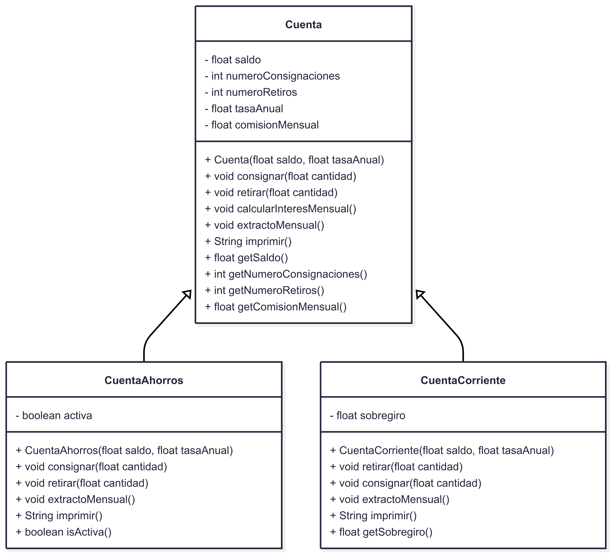

# 💳 Modelo de Cuenta Bancaria

Este proyecto consiste en desarrollar un programa que modele una cuenta bancaria utilizando programación orientada a objetos. Se implementa una clase base `Cuenta` y dos clases derivadas: `CuentaAhorros` y `CuentaCorriente`.

---

## 🧩 Clase Base: `Cuenta`

### 🔐 Atributos (de acceso protegido)
- `saldo`: `float`
- `num_consignaciones`: `int` (inicializado en 0)
- `num_retiros`: `int` (inicializado en 0)
- `tasa_anual`: `float`
- `comision_mensual`: `float` (inicializado en 0)

### ⚙️ Métodos
- `consignar(cantidad)`: Añade dinero al saldo.
- `retirar(cantidad)`: Retira dinero del saldo si hay fondos suficientes.
- `calcular_interes_mensual()`: Calcula el interés mensual y lo suma al saldo.
- `extracto_mensual()`: Aplica la comisión mensual y el interés.
- `imprimir()`: Retorna los valores actuales de los atributos.

---

## 🏦 Clase Derivada: `CuentaAhorros`

### 🧠 Atributo adicional
- `activa`: `bool` — La cuenta está activa si el saldo ≥ $10,000.

### 🔄 Métodos redefinidos
- `consignar(cantidad)`: Solo si la cuenta está activa. Invoca el método heredado.
- `retirar(cantidad)`: Solo si la cuenta está activa. Invoca el método heredado.
- `extracto_mensual()`: Si hay más de 4 retiros, se cobra $1000 por cada retiro adicional. Determina si la cuenta sigue activa.
- `imprimir()`: Retorna el saldo, comisión mensual y número total de transacciones.

---

## 🏛️ Clase Derivada: `CuentaCorriente`

### 🧠 Atributo adicional
- `sobregiro`: `float` (inicializado en 0)

### 🔄 Métodos redefinidos
- `retirar(cantidad)`: Permite retirar más del saldo. El exceso se convierte en sobregiro.
- `consignar(cantidad)`: Invoca el método heredado. Si hay sobregiro, lo reduce.
- `extracto_mensual()`: Invoca el método heredado.
- `imprimir()`: Retorna el saldo, comisión mensual, número total de transacciones y valor del sobregiro.

---

## ✅ Requisitos

- 📐 Diagrama UML de clases
- 🧪 Tests unitarios con cobertura mínima del **70%**

---

## 📦 Entregables

- 📁 Repositorio en GitHub
- 🖼️ Captura de pantalla del diagrama de clases o enlace público a diagrams.net
- 🧾 Captura de pantalla de la sección de testing en VSCode mostrando la cobertura de tests

---

## Diagrama de clases UML

## Captura de testing

